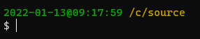

# Prompts

I use the command line a lot. Next to all of my git activity is performed through the command prompt (bash normally). That together with analysing logs, interacting with kubernetes, to mention a few, means that I nearly always have at least one command prompt open.

To make my life easier, and a little more pleasant, when using them I've customised the prompts in the following consoles to give a more consistent feel, all of the prompts will show the same prompt:



In git bash, the name of the branch will also be shown.

There is a serious side to this however. It is common for a command to run for some time, and not always provide detail about when it has completed. The prompt gives this detail as the prompt will show the time as-of the completion of the previous command.

In addition it also gives an indication of when the prior command was run. This can be helpful when debugging or diagnosing time-based activities. Also helpful when trying to ascertain whether something is stale or not.

They're set using the commands below:

## Bash
Edit `C:\Program Files\Git\etc\profile.d\git-prompt.sh` and modify the lines in the `else` block to show:

```sh
if test -f ~/.config/git/git-prompt.sh
then
    . ~/.config/git/git-prompt.sh
else
    PS1='\[\033]0;$TITLEPREFIX:$PWD\007\]'              # set window title
    PS1="$PS1"'\n'                                      # new line
    PS1="$PS1"'\[\033[32m\]'                            # change to green
    PS1="$PS1"'`date +%Y-%m-%d`'@'`date +%H:%M:%S` '    # date & time in yyyy-MM-dd@HH:mm:ss format
    PS1="$PS1"'\[\033[33m\]'                            # change to brownish yellow
    PS1="$PS1"'\w'                                      # current working directory
```

Alternatively copy the git-prompt.sh file from the path above to `%userprofile%/.config/git/git-prompt.sh` and modify the content there. This will mean the change is made for your user account rather than everyone on the same computer.

Save and re-open the prompt. You may need to launch the editor in administrator mode.

## Powershell
Open the powershell and type `notepad $PROFILE`.

If you've not edited your powershell profile before, you'll be prompted to create the file.

Enter the following:

```powershell
function Prompt {
  $esc = [char]27
  return "$ESC[32m{0:yyyy-MM-dd@HH:mm:ss} $ESC[33m{1}`n$ESC[0m> " -f (Get-Date),(Get-Location)
}
```

Close and re-open powershell.

You may also need to enable script execution on your machine. To do so, open powershell as an administrator and run the following command:

```powershell
Set-ExecutionPolicy Unrestricted
```

## Windows command prompt

Run the following command.

```
setx PROMPT /M $e[32m$D@$T$S$e[33m$P$_$e[0m$G$S
```

There is no need to restart the command prompt, the change should show immediately.
